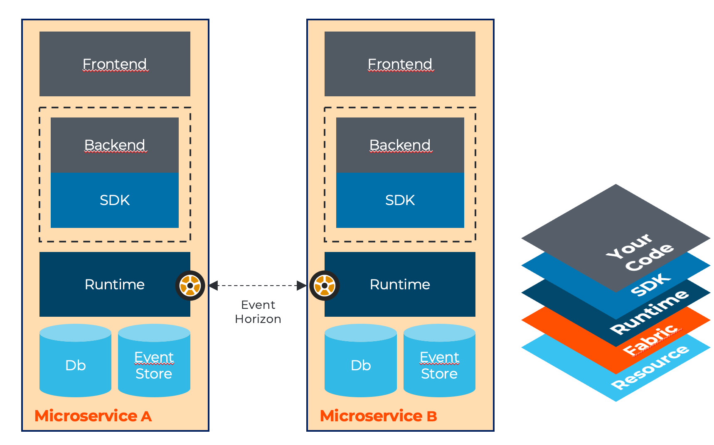
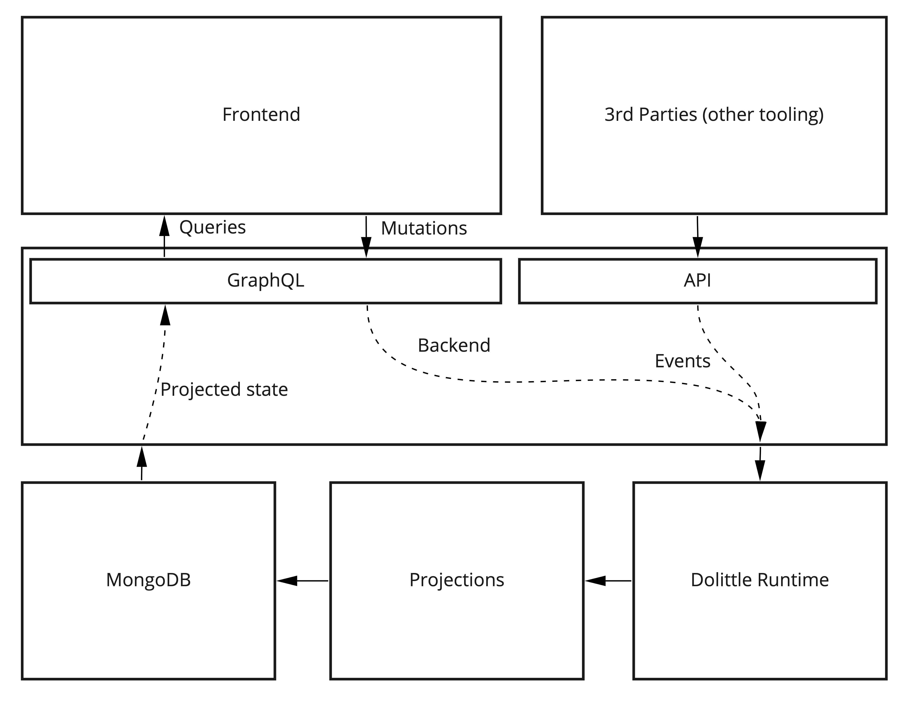

# Architecture

This page holds target architecture that Vanir represents.

## Microservices

Vanir is all about getting started with Dolittle Microservices. These are completely autonomous parts with an end to
end ownership of everything. This enables each module of the system to be completely decoupled from any other
part. At the core of each microservice sits the runtime services provided by Dolittle.

Communication between microservices is through events and not any point-to-point communication like APIs or similar.
The different microservices does not know about any of the other microservices. The communication is configured
for the runtime.

The solution consists of multiple microservices. Typically one develops on one of these at a time.
To get started with them, read below about what they are and how to get started.

## Events

Both internally to a microservice and externally events can play a role. Capturing the state changes as domain events or
business moments is one of the things the Dolittle runtime is designed for.

The term event is overused and can easily be confused. Read more about the Dolittle meaning of an event [here](https://dolittle.io/docs/concepts/events/).
In addition to this, it is important to understand the concepts of [event sourcing](https://dolittle.io/docs/concepts/event_sourcing/)
and our [event store](https://dolittle.io/docs/concepts/event_store/).

## Detailed Anatomy

A Vanir microservice looks as follows:

Using GraphQL for exposing queries and mutations to a frontend is based on a few things:

* Great tooling experience for developers (GraphQL playground).
* Payloads can be optimized for its use case.
* GraphQL supports a reactive nature through its subscription model - which fits with our own vision of reactive applications.
* We can easily extend on GraphQL client libraries and provide a push model for changes on queries used by a client.

Another consideration is to keep publicly exposed APIs separate from private. Anything that is public
and potentially consumed by 3rd parties needs a more rigorous versioning scheme. They are representing different concerns
and a public API should be considered an anti-corruption layer.

Public APIs are today from Vanir ReSTful. This is just a temporary limitation and there is nothing conceptually holding
back for doing GraphQL for public APIs as well. But still, keeping a private API and a public API is a good design principle.

> Pushing data to client when data changes, such as MongoDB change streams or when a projection occurs
> is a goal for Vanir and not supported today. The goal is to extend on the Apollo client library and set up a stream
> to the backend for changes to be pushed.

## Projections

It is not a viable solution to run through the events to get the current state, as this would make the
system slower and slower over time.

Instead, when events occur we want to project these down to current state of the system. This new state
can then be used in queries if the storage used to project to allows for that.

Since events represent the source of truth in the system, we can create multiple projections optimized for
the purpose we want. The projection can be stored in the storage fit for purpose as well, giving great flexibility.

## Idempotency

When working with event sourced systems with an event store; you need to think about the concept of being able
to run through the events multiple times and reach the same conclusion - or the same projected state.
This concept is known as idempotency.

## Declarative

The task of converting the chopped up truth represented by events is somewhat repetitive in nature.
In addition, tackling the concept of idempotency can be tricky and especially when one is doing projections
that involves multiple event sources.

In the Vanir microservice template, the Dolittle projection engine is configured and ready to be used (read more [here](https://github.com/dolittle-entropy/projections)).
Its goal is to do the heavy lifting and make projecting to a current state effortless. You can read
on the API and usage [here](https://github.com/dolittle-entropy/projections/tree/main/Documentation).
There is also a sample [here](https://github.com/dolittle-entropy/projections/tree/main/Samples/Basic).

## Imperative

For some scenarios, you might not get what you want from the declarative approach and you will have to
revert to a more imperative approach - this is where you create a regular [event handler](./event-handlers.md)
and do what you want.

> Important: We prefer the declarative approach as it is more maintainable and gives a better opportunity
> for scaling out at runtime. So consider an imperative approach only if the declarative does not cover
> your needs.

## Document oriented

One of the opportunity with projections is to become more document oriented rather than relational.
From this you avoid those dreaded N+1 queries and having to optimize indexes between tables to get any **joins** fast.
Documents are also conceptually closer to what one it typically aiming for as the object model, which then
often leads to faster systems. Read more about document modelling [here](https://docs.mongodb.com/manual/core/data-modeling-introduction/).
