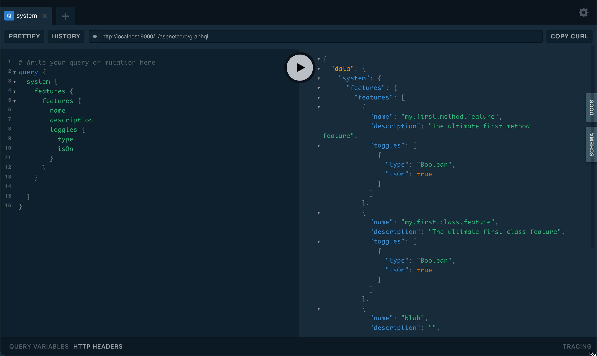
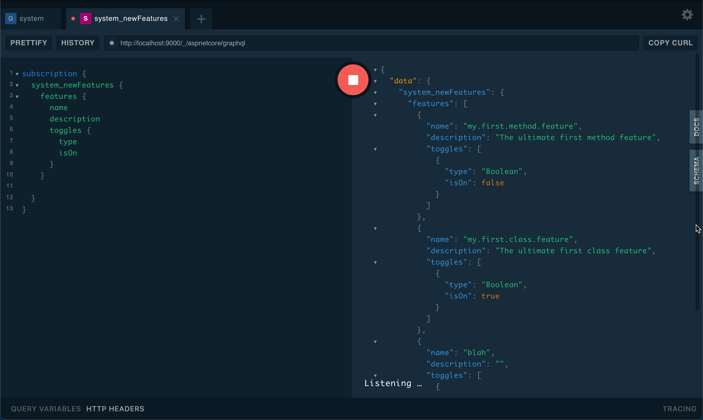

# Feature Toggling - GraphQL

The feature system is implemented with a GraphQL schema for feature toggling that looks the same both for
[.NET](../DotNET/index.md) and [NodeJS](../typescript/index.md).

## Query Features

To list the details of the features in the system, one can use the rooted `system` query as below:

## Subscriptions

It is possible to listen for changes to the feature system. If it changes state on a toggle, features are added or removed.
The subscription is prefixed as a `system` subscription and can be used as below.

