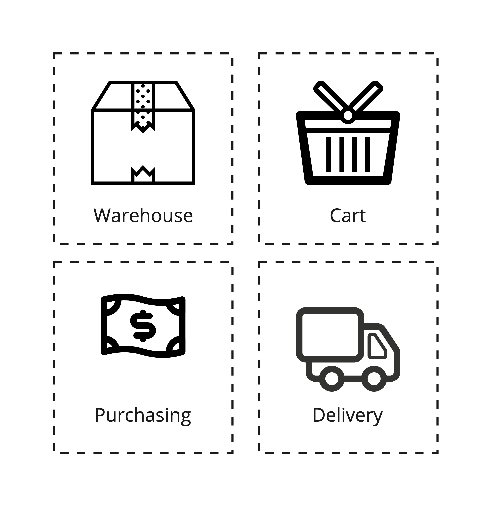
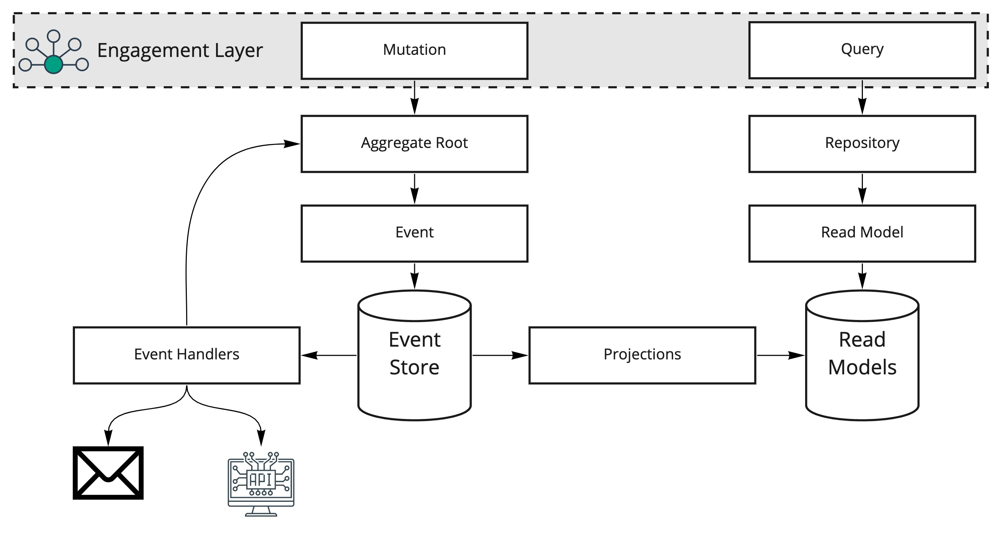

# General Guidance

Dolittle is all about [event sourcing](https://dolittle.io/docs/concepts/event_sourcing/) build on top of
our own [event store](https://dolittle.io/docs/concepts/event_store/). In an event sourced system the source
of truth is all the events. Traditional systems would consider the database as the source of truth.
In a Dolittle based event sourced system, the database should never be relied on, it does not represent the
truth and you should have your truth be represented as [events](https://dolittle.io/docs/concepts/events/).

## Microservices

Part of the Dolittle story is the focus on [microservices](https://en.wikipedia.org/wiki/Microservices).
All of the concepts and components that goes into a Dolittle microservice is described [here](https://dolittle.io/docs/concepts/overview/).

The main goal of microservices is to split up monolithic systems, decouple naturally the parts that can be decoupled
and let these new parts be autonomous and move and release at their own cadence.

How do one identify where to draw the line and make the split. This is not a technical question, you can find
answers in looking into things like [Domain Driven Design](https://www.amazon.com/Domain-Driven-Design-Tackling-Complexity-Software/dp/0321125215/ref=sr_1_1?dchild=1&keywords=domain+driven+design&qid=1618162396&sr=8-1). You can also read more about Domain Driven Design from our own
documentation [here](https://dolittle.io/docs/contributing/guidelines/domain_driven_design/).

In most systems when talking to the domain experts or the different users of a system, you can find the natural splits.
Often at times it boils down to established organizational differences and the type of people (personas) in the different
departments. But even if it is the same persona you might find that there are natural parts of the system that can be
decoupled from each other. Within Domain Driven Design (DDD) you can find the concept of bounded contexts.

Take for instance an eCommerce. Within an eCommerce from an organizational perspective you'll find multiple departments
with in fact multiple different names for the same thing that we tend to model as an abstract concept called "Product".
In a traditional system, we might model this as a table in a database and put all the columns related to this "Product"
from all the different aspects of the business.

Within the warehouse, the product would be referred to a as a **box**. The definition of this **box** would probably only include
information such as dimensions, weight and location in the warehouse. The people in the warehouse does not care about
the manufacturer, its price or anything else.

While in purchasing they do care about the manufacturer, as that is who to contact when one is nearing out-of-stock and
also to get the right price for the **product**. And they might use the word **product** here.

For the delivery person, the main properties of the **package** to deliver are where to deliver it.

Finally for the customer looking to purchase, they browse around the catalog and find things they're interested in and would
very much like as much details as possible about what they're looking for, including images, descriptions, details, price and more.
Once they've found what they're looking for they would like to put the **item** in their cart.

In all of these different bounded contexts they have different words and different properties they're interested in.
Instead of modelling this in large system, breaking it up and optimizing each individual piece makes sense.

There is a lot of articles out there on the topic, but Microsoft has one that could be of inspiration, read more [here](https://docs.microsoft.com/en-us/dotnet/architecture/microservices/microservice-ddd-cqrs-patterns/ddd-oriented-microservice).

## System flow

The flow through a system should be somewhat like below:

Each individual part plays a role and is very much adhering to the [Separation of Concerns](https://en.wikipedia.org/wiki/Separation_of_concerns) principle.

Aggregate roots play a vital part here. A construct well defined within Domain Driven Design, you can read more about
Dolittles implementation of this [here](https://dolittle.io/docs/tutorials/aggregates/).

Since events are the source of truth and with our [streams](https://dolittle.io/docs/concepts/streams/) and [projections](https://dolittle.io/docs/tutorials/projections/)
we can guarantee the order of the events and a only-once delivery, you can leverage these for different scenarios.
An [event handler](https://dolittle.io/docs/concepts/event_handlers_and_filters/) can for instance perform operations that are not related to
the state / data of the application. It could perform actions such as send emails, contact other APIs such as ReST APIs and similar.

### Reactions

A very good use case for event sourced systems is the ability for a typical "If this then that" type of scenario.
We often refer to these as reactions. Something that receives a stream of events and looks for a particular state or condition occur
and then trigger a reaction to that. The reaction could typically be to talk back to an aggregate root that could apply
new events that gets committed for the scenario that was met from the condition it defines.

> A reaction is just an event handler that gets its own stream. This event handler can maintain its own state if it needs to
> or even have its own projection that represents this state and then reacting to a state change and trigger behavior in the
> domain by talking to an aggregate root.

## Learn more?

Below is a table of some resources to related topics.

| Topic | Resource |
| ----- | -------- |
| Domain Driven Design | https://dolittle.io/docs/contributing/guidelines/domain_driven_design/ |
| Development Principles | https://dolittle.io/docs/contributing/guidelines/development_principles/ |
| Aggregates | https://dolittle.io/docs/tutorials/aggregates/ |
| Event Handlers | https://dolittle.io/docs/concepts/event_handlers_and_filters/ |
| Projections | https://dolittle.io/docs/tutorials/projections/ |

